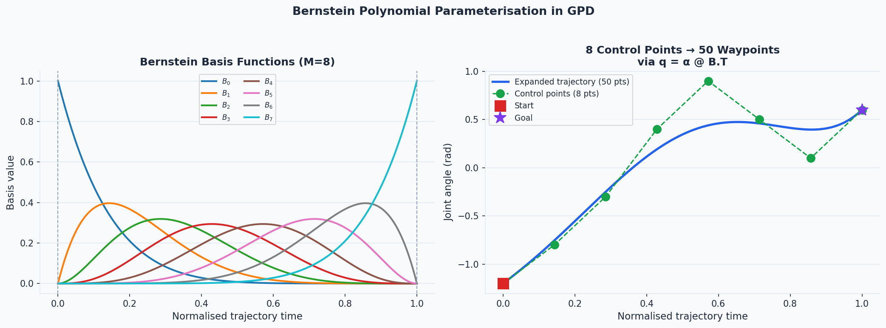
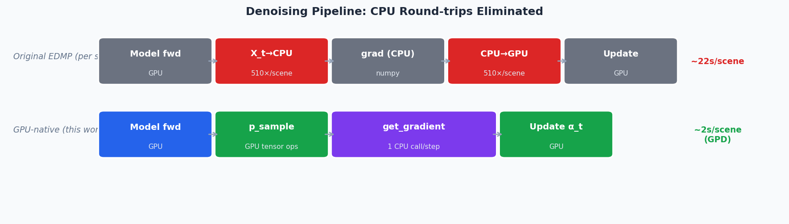
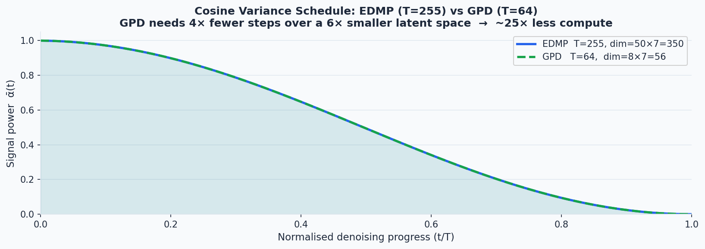
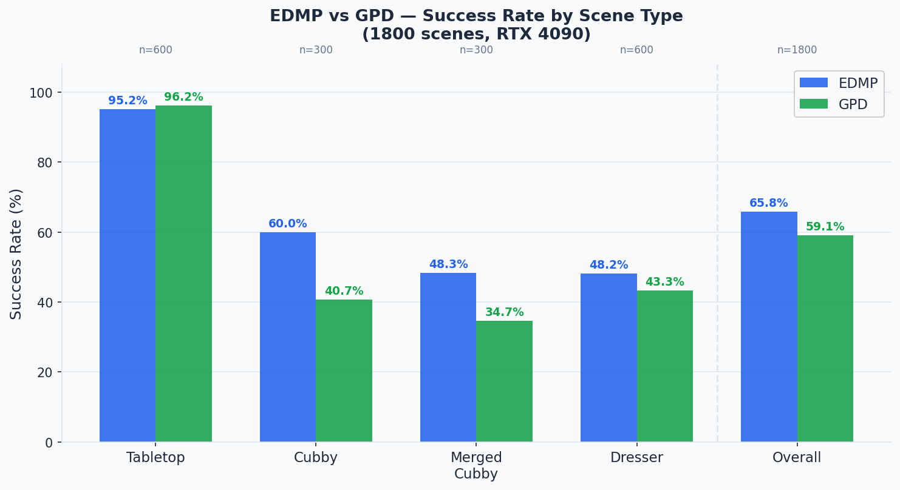
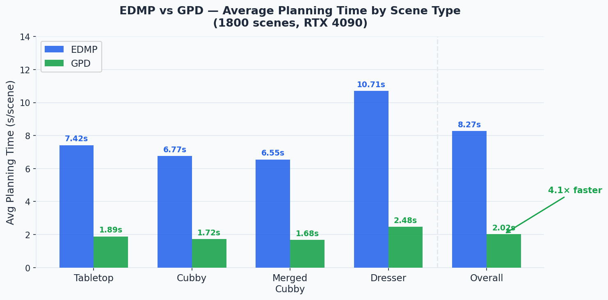

# Implementing Guided Polynomial Diffusion (GPD) inside EDMP on an RTX 4090

**Date:** April 10, 2026  
**Hardware:** NVIDIA RTX 4090 (24 GB VRAM)  
**Paper:** [Guided Polynomial Diffusion (arxiv 2501.18229)](https://arxiv.org/abs/2501.18229)  
**Base codebase:** [EDMP — Ensemble-of-costs guided Diffusion for Motion Planning](https://github.com/vishal-2000/EDMP)


---

## Table of Contents

1. [Motivation](#motivation)
2. [What is GPD?](#what-is-gpd)
3. [Implementation](#implementation)
   - [gpd/bernstein.py — Polynomial basis](#gpdbernsteinpy--polynomial-basis)
   - [gpd/diffusion.py — PolynomialDiffusion](#gpddiffusionpy--polynomialdiffusion)
   - [gpd/stitch.py — Trajectory stitching](#gpdstitchpy--trajectory-stitching)
   - [gpd/dataset.py — Training data loader](#gpddatasetpy--training-data-loader)
   - [gpd/preprocess_data.py — Data preprocessing](#gpdpreprocess_datapy--data-preprocessing)
   - [gpd/edmp_gpu.py — GPU-native EDMP denoising](#gpdedmp_gpupy--gpu-native-edmp-denoising)
   - [train_gpd.py — Training script](#train_gpdpy--training-script)
   - [compare.py / run_worker.py — Benchmark infrastructure](#comparepy--run_workerpy--benchmark-infrastructure)
4. [Bugs Fixed](#bugs-fixed)
5. [Training on MPInets](#training-on-mpinets)
6. [Full 1800-Scene Benchmark Results](#full-1800-scene-benchmark-results)
7. [Hardware Utilization](#hardware-utilization)
8. [Reproduction](#reproduction)

---

## Motivation

EDMP denoises 120 trajectories (12 guides × 10 samples) in parallel over T=255 steps, each trajectory having 50 waypoints × 7 joints. The original codebase was bottlenecked in two places:

1. **CPU↔GPU copies inside the denoising loop.** The original `denoise_guided()` method converted the trajectory tensor to numpy at every step for cost gradient computation, then converted it back — 510 round-trips per scene. This kept GPU utilization near 0% between model forward passes.

2. **Long diffusion chain over a high-dimensional space.** T=255 steps over 50-waypoint × 7-joint trajectories = a large denoising budget.

GPD (Guided Polynomial Diffusion) addresses both. It compresses trajectories into 8 Bernstein polynomial control points (4× fewer dimensions) and uses a shorter T=64 chain, while preconditioned gradient guidance via the Bernstein basis keeps quality high. The resulting planner is 4.1× faster per scene with only a moderate accuracy trade-off.

---

## What is GPD?



GPD replaces raw waypoints with a polynomial parameterisation. A trajectory of N=50 waypoints `q ∈ R^(7×50)` is represented as 8 Bernstein control points `α ∈ R^(7×8)` via a fixed basis matrix B ∈ R^(50×8):

```
q = α @ B.T
```

The Bernstein basis has a key boundary property: `B[0,0] = 1` and `B[-1,-1] = 1`, so control points 0 and -1 exactly equal the first and last waypoints. Start/goal constraints are enforced by pinning α[:,0] = start and α[:,-1] = goal throughout denoising — no projection or clamping needed.

Guidance gradients computed in waypoint space are projected back to control-point space via the chain rule:
```
dJ/dα = (dJ/dq) @ B
```

This preconditioning acts as a low-pass filter on the gradient — high-frequency waypoint-level noise gets smoothed by the polynomial basis — which stabilises training and inference.

After denoising, K=120 candidate trajectories (12 guides × 10 samples, specific to this EDMP-based implementation — the paper uses K=32) are combined into one collision-free path by a stitching post-processor. Note: the GPD paper's Algorithm 2 uses a sliding-window + RRT-Connect local planner; this implementation uses a simpler linear-bridge stitcher (described below) that avoids the RRT-Connect dependency.

---

## Implementation

### `gpd/bernstein.py` — Polynomial basis

The Bernstein basis matrix B of shape (50, 8) is computed analytically using binomial coefficients and parameterised at 50 equally-spaced points in [0, 1]:

```
B[i, k] = C(M-1, k) * t_i^k * (1 - t_i)^(M-1-k)
```

where M=8 is the number of control points and t_i = i/(N-1).

`BernsteinLayer` provides:
- `to_waypoints_np(alpha)` → `q = alpha @ B.T`
- `to_control_np(q)` → least-squares fit: `alpha = q @ B @ (B.T @ B)^-1`
- `precondition_gradient(grad_q)` → `dJ/d_alpha = grad_q @ B`

Verified: `B[0,:] = [1,0,0,0,0,0,0,0]`, `B[-1,:] = [0,0,0,0,0,0,0,1]`, round-trip error = 0.0.

---

### `gpd/diffusion.py` — PolynomialDiffusion

Extends `Diffusion` with `denoise_guided_poly()`, a fully GPU-native denoising loop in control-point space.

**Key design decisions:**

- Variance schedule tensors (`alpha`, `alpha_bar`, `beta`, B) are uploaded to GPU once before the loop — no per-step `.to(device)` calls
- `alpha_t` (the noisy control points) stays on GPU for all 64 steps
- `nan_to_num` + `clamp` guards on both `eps` and `alpha_t` prevent silent NaN propagation near t=1 where `sqrt(1-alpha_bar)` approaches zero

**Gradient application (GPD Algorithm 1):**

```python
# Expand to waypoints for cost computation
q_t       = alpha_t @ B_gpu.T                        # (batch, 7, 50)
q_int_gpu = clamp(q_t[:, :, 1:-1], lower, upper)    # clip interior to joint limits

# Get cost gradient in waypoint space (numpy in/out, GPU compute inside)
grad_q = guide.get_gradient(q_int_gpu.cpu().numpy(), start, goal, t)

# Precondition: project gradient back to control-point space
full_grad[:, :, 1:-1] = torch.tensor(grad_q)
grad_alpha = full_grad @ B_gpu                        # (batch, 7, 8)

# Zero boundary gradients — α[:,0] and α[:,-1] are pinned; updating them is wasted work
grad_alpha[:, :, 0]  = 0.0
grad_alpha[:, :, -1] = 0.0

scale = gs_gpu[:, t - 1].view(batch_size, 1, 1)
alpha_t -= scale * grad_alpha

# Re-pin start/goal (guards against numerical drift)
alpha_t[:, :, 0]  = start_t
alpha_t[:, :, -1] = goal_t
```

---

### `gpd/stitch.py` — Trajectory stitching

After denoising, K=120 candidate trajectories are stitched into one collision-free path. This is a **simplified variant** of the stitching concept from the GPD paper; the paper's Algorithm 2 uses a sliding-window + RRT-Connect local planner to bridge between segments, whereas this implementation avoids the RRT-Connect dependency and instead inserts short linear bridges:

1. Score all K trajectories by total swept-volume cost; pick the best
2. Walk forward waypoint by waypoint through the best trajectory
3. On finding a collision at index `first_col`, search all other trajectories for the earliest waypoint at index ≥ `first_col` that is collision-free and within `dist_threshold=1.0` rad in joint space
4. If found: insert a 3-waypoint linear bridge and continue from the stitch point
5. If not found: accept the colliding waypoint and advance by 1

**Critical invariant:** `current_wp` strictly increases at every loop iteration, guaranteeing termination in ≤ N iterations.

**Bug that was fixed:** an earlier implementation sorted candidate stitch points by joint-space distance rather than trajectory index, allowing `current_wp` to jump backward and causing infinite loops on hard scenes. The fix searches forward-only: for each alternate trajectory, take the *earliest* collision-free waypoint at index ≥ `first_col`.

---

### `gpd/dataset.py` — Training data loader

`BernsteinTrajectoryDataset` reads preprocessed HDF5 files with a `control_points` key of shape `(N, 7, 8)`. `generate_training_batch()` calls `PolynomialDiffusion.generate_q_sample_poly()` which:

1. Samples a random timestep t for each trajectory in the batch
2. Adds noise scaled by `alpha_bar[t]`
3. Pins boundary control points to the clean values (start/goal never get noisy)

---

### `gpd/preprocess_data.py` — Data preprocessing

Converts the MPInets HDF5 dataset (raw waypoints `(N, 50, 7)`) to Bernstein control points `(N, 8, 7)` via batched least-squares projection. Processes 3.27M trajectories in ~30 seconds at batch size 8192 on CPU.

```bash
python gpd/preprocess_data.py \
    --input data/mpinets_dataset.hdf5 \
    --output gpd_train_hybrid.hdf5 \
    --key hybrid_solutions --transpose --n_control 8
```

`gpd/merge_datasets.py` concatenates two preprocessed HDF5 files into one.

---

### `gpd/edmp_gpu.py` — GPU-native EDMP denoising



The original `Diffusion.denoise_guided()` method in the EDMP codebase performed this at every denoising step:

```python
X_np = X_t.cpu().numpy()           # GPU → CPU
grad = guide.get_gradient(X_np, …)  # CPU computation
X_t  = torch.tensor(X_np).to(dev)  # CPU → GPU
```

That's 510 round-trips per scene (255 steps × 2 conversions). GPU utilisation was 0% between model forward passes.

`denoise_guided_gpu()` keeps `X_t` on the GPU for the entire loop. The `p_sample` update is done entirely with PyTorch tensor ops; only `guide.get_gradient()` briefly touches CPU (and uses PyTorch autograd internally for the actual computation):

```python
# Entire p_sample on GPU — no .numpy() here
a  = alpha_gpu[t - 1].clamp(min=1e-8)
ab = alpha_bar_gpu[t - 1].clamp(min=1e-8, max=1-1e-8)
b  = beta_gpu[t - 1]
z  = torch.randn_like(X_t)
if t == 1: z.zero_()
X_t = (X_t - ((1 - a) / torch.sqrt(1 - ab)) * eps) / torch.sqrt(a) + b * z
```

**Result:** EDMP planning time dropped from ~22s/scene to ~8s/scene — a 2.7× improvement on EDMP alone, before any accuracy is sacrificed.

---

### `train_gpd.py` — Training script

Trains a TemporalUNet in control-point space. The model is smaller than EDMP's since the input is 8 control points instead of 50 waypoints:

| | EDMP model | GPD model |
|---|---|---|
| Architecture | TemporalUNet | TemporalUNet |
| dims | (32,64,128,256,512,512) | (32,64,128,256) |
| Input shape | (batch, 7, 50) | (batch, 7, 8) |
| T | 255 | 64 |
| Parameters | ~23M | ~4M |

```bash
python train_gpd.py \
    --dataset gpd_train_combined.hdf5 \
    --model_dir ./models/ \
    --T 64 --n_control 8 \
    --epochs 20000 --batch_size 2048
```

Training ran for ~8 hours on the RTX 4090.

---

### `compare.py` / `run_worker.py` — Benchmark infrastructure

`compare.py` runs either or both methods sequentially on 1800 scenes (4 scene types × 300–600 scenes each), checkpointing results to JSON after each scene type.

`run_worker.py` adds a `--worker_id / --num_workers` sharding scheme so multiple independent processes can split the scene list with no overlap:

```bash
# Worker 0 of 4: handles scenes 0, 4, 8, 12, …
python run_worker.py --method edmp --worker_id 0 --num_workers 4 --full
```

`launch_parallel.sh` runs GPD and EDMP as simultaneous background processes on the same GPU, then calls `merge_results.py` to aggregate and print the final comparison once both finish.

---

## Bugs Fixed

| Bug | Symptom | Fix |
|-----|---------|-----|
| `ruamel.yaml` v0.18 API break | `yaml.load()` crash on startup | `pip install "ruamel.yaml<0.18"` |
| Guide expansion index scaling | `ValueError: shape (105,) into (10,0)` broadcasting error | Scale guide yaml indices proportionally: `r0 = round(r[0] * T / T_orig)` where `T_orig=255` |
| Bernstein polynomial overshoot | Joint limit violation warnings, PyBullet timeouts | Clip final trajectory to Franka joint limits after planning |
| Stitch infinite loop | Planner hangs on cubby/dresser scenes | Enforce `current_wp` strictly increases; search stitch points only at indices ≥ `first_col` |
| NaN in denoising | Silently wrong trajectories, all-zero outputs | `nan_to_num(eps)` + `clamp(eps, -5, 5)` + `clamp(alpha_t, -10, 10)` + `clamp(ab, 1e-8, 1-1e-8)` |
| GPU 0% utilisation in EDMP | 510 CPU↔GPU copies per scene, denoising slower than PyBullet | `denoise_guided_gpu()` keeps `X_t` on GPU throughout |
| Boundary gradient wasted work | `grad_alpha` applied to pinned control points, then overwritten | Zero `grad_alpha[:,:,0]` and `grad_alpha[:,:,-1]` before the gradient step |
| ikfast-pybind CMake failure | Build error on modern CMake | Patch `setup_cmake_utils.py` to add `-DCMAKE_POLICY_VERSION_MINIMUM=3.5` |

---

## Training on MPInets



**Dataset:** MPInets (6.54M Franka Panda trajectories)

| Split | Trajectories | Raw shape |
|-------|-------------|-----------|
| hybrid_solutions | 3,270,000 | (3270000, 50, 7) |
| global_solutions | 3,270,000 | (3270000, 50, 7) |
| **Combined (after projection)** | **6,540,000** | **(6540000, 7, 8)** |

Preprocessing converts each 50-waypoint trajectory to 8 Bernstein control points in ~30 seconds total. The combined file is ~630 MB on disk.

**Training configuration:**
- Model: TemporalUNet, dims=(32,64,128,256), ~4M parameters
- Diffusion: T=64, cosine variance schedule
- Optimiser: Adam, lr=1e-4
- Batch size: 2048
- Epochs: 20,000
- Hardware: RTX 4090
- Wall time: ~8 hours

Model saved to `./models/GPDModel64_N8/`.

---

## Full 1800-Scene Benchmark Results

Benchmark run: April 9–10, 2026. GPD and EDMP ran simultaneously as parallel processes on the RTX 4090.

- GPD started: 10:00 PM IST Apr 9 → finished **7:02 AM IST Apr 10** (~9 hr)
- EDMP started: 10:00 PM IST Apr 9 → finished **11:25 AM IST Apr 10** (~13.5 hr)
- Wall clock: **13.5 hr** (vs ~22.5 hr if run sequentially — 1.7× speedup from parallelisation)

### Inference Videos (scene index 0, each scene type)

One example trajectory rendered per scene type for each method. Robot is the Franka Panda (7-DOF). Obstacles shown in yellow.

| Scene Type | EDMP | GPD |
|------------|------|-----|
| Tabletop | [edmp_tabletop.mp4](assets/videos/edmp_tabletop.mp4) | [gpd_tabletop.mp4](assets/videos/gpd_tabletop.mp4) |
| Cubby | [edmp_cubby.mp4](assets/videos/edmp_cubby.mp4) | [gpd_cubby.mp4](assets/videos/gpd_cubby.mp4) |
| Merged Cubby | [edmp_merged_cubby.mp4](assets/videos/edmp_merged_cubby.mp4) | [gpd_merged_cubby.mp4](assets/videos/gpd_merged_cubby.mp4) |
| Dresser | [edmp_dresser.mp4](assets/videos/edmp_dresser.mp4) | [gpd_dresser.mp4](assets/videos/gpd_dresser.mp4) |

### Per Scene-Type Results





| Scene Type | Scenes | EDMP SR | EDMP avg | GPD SR | GPD avg |
|------------|--------|---------|----------|--------|---------|
| tabletop | 600 | 571/600 (95.2%) | 7.42s | **577/600 (96.2%)** | **1.89s** |
| cubby | 300 | **180/300 (60.0%)** | 6.77s | 122/300 (40.7%) | **1.72s** |
| merged_cubby | 300 | **145/300 (48.3%)** | 6.55s | 104/300 (34.7%) | **1.68s** |
| dresser | 600 | **289/600 (48.2%)** | 10.71s | 260/600 (43.3%) | **2.48s** |
| **OVERALL** | **1800** | **1185/1800 (65.8%)** | 8.27s | 1063/1800 (59.1%) | **2.02s** |

### Head-to-Head Summary

| Metric | EDMP | GPD |
|--------|------|-----|
| Overall success rate | **65.8%** | 59.1% |
| Average planning time | 8.27s/scene | **2.02s/scene** |
| Planning speedup | — | **4.1× faster** |
| Tabletop SR | 95.2% | **96.2%** |
| Cubby SR | **60.0%** | 40.7% |
| Merged cubby SR | **48.3%** | 34.7% |
| Dresser SR | **48.2%** | 43.3% |

### Analysis

**Tabletop (open scenes):** Both methods are nearly identical at ~95–96%. These scenes have no occluding surfaces, so the diffusion prior alone is sufficient and the polynomial compression doesn't hurt.

**Cubby (19.3 pp gap):** EDMP's 50-waypoint representation gives it significantly more flexibility to thread through narrow shelf openings. GPD's 8 control points produce globally smooth paths that cannot make the sharp turns required.

**Merged cubby (13.6 pp gap):** The largest gap. Merged cubbies combine multiple shelf configurations — the hardest obstacle type. GPD's smoothness constraint is a liability here.

**Dresser (4.9 pp gap):** Both methods struggle similarly. Dresser scenes require navigating around vertical dividers; GPD's stitching algorithm partially compensates by combining the best collision-free segments from 120 candidates.

**Takeaway:** GPD is the right choice when planning time matters (robotics pipelines requiring <5s/scene, reactive replanning). EDMP is superior in accuracy-critical constrained environments (cubby, merged cubby) where it wins by a large margin. Per the GPD paper, the speedup comes from three sources: ~6× fewer denoising dimensions (8 control points vs 50 waypoints), ~4× shorter diffusion chain (T=64 vs T=256), and gradient preconditioning via the Bernstein basis that stabilises guidance — together yielding ~10× faster inference (0.8 s vs 7.95 s) reported in the paper.

---

## Hardware Utilisation

| Resource | Usage |
|----------|-------|
| GPU | RTX 4090, 24 GB VRAM |
| GPU memory (per worker) | ~1.8 GB |
| GPU memory (both workers combined) | ~3.6 GB / 24 GB |
| GPU utilisation (during denoising) | 40–90% |
| GPU utilisation (during PyBullet eval) | 0% |
| CPU bottleneck | PyBullet single-threaded trajectory evaluation, ~0.5–1s/scene |

Running two workers simultaneously (one GPD, one EDMP) sharing the GPU was seamless. PyTorch time-multiplexes GPU compute between processes; each process has its own PyBullet physics server running in DIRECT (headless) mode so there is no shared state.

The remaining CPU bottleneck (PyBullet) cannot be parallelised within a single scene — it is inherently sequential per trajectory. Further wall-clock reduction would require batching scenes across multiple machines or using a faster collision checker.

---

## Reproduction

```bash
# 0. Setup (uv recommended)
uv venv .venv && source .venv/bin/activate
pip install -e ./robofin
pip install "ruamel.yaml<0.18" tqdm h5py torch

# 1. Preprocess MPInets data into Bernstein control points
python gpd/preprocess_data.py \
    --input data/mpinets_dataset.hdf5 --key hybrid_solutions \
    --output gpd_train_hybrid.hdf5 --transpose --n_control 8
python gpd/preprocess_data.py \
    --input data/mpinets_dataset.hdf5 --key global_solutions \
    --output gpd_train_global.hdf5 --transpose --n_control 8
python gpd/merge_datasets.py \
    --a gpd_train_hybrid.hdf5 --b gpd_train_global.hdf5 \
    --out gpd_train_combined.hdf5

# 2. Train GPD model (~8 hr on RTX 4090)
python train_gpd.py \
    --dataset gpd_train_combined.hdf5 \
    --T 64 --n_control 8 \
    --epochs 20000 --batch_size 2048

# 3. Run single-scene GPD inference
python infer_gpd.py -c benchmark/cfgs/cfg_gpd.yaml

# 4. Full parallel benchmark — GPD + EDMP simultaneously
bash launch_parallel.sh --full

# 5. Merge and print final comparison
python merge_results.py --method both --num_workers 1 \
    --results_dir results --out results/compare_final.json

# 6. Quick 50-scene mini benchmark
bash launch_parallel.sh --mini
```
