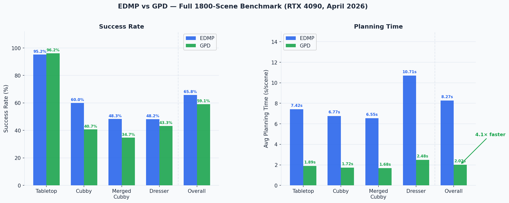

# EDMP: Ensemble-of-Costs Guided Diffusion For Motion Planning

[Kallol Saha](https://www.linkedin.com/in/kallolsaha/) <sup>\*1</sup>,
[Vishal Mandadi](https://vishal-2000.github.io/) <sup>\*1</sup>,
[Jayaram Reddy](http://www.linkedin.com/in/jayaram6111997) <sup>\*1</sup>,
[Ajit Srikanth](https://twitter.com/ajitsrikanth) <sup>1</sup>,
[Aditya Agarwal](https://skymanaditya1.github.io/) <sup>2</sup>,
[Bipasha Sen](https://bipashasen.github.io/) <sup>2</sup>,
[Arun Kumar Singh](https://tuit.ut.ee/en/content/arun-kumar-singh) <sup>3</sup>,
[Madhava Krishna](https://www.iiit.ac.in/people/faculty/mkrishna/) <sup>1</sup>,

<sup>1</sup>International Institute of Information Technology, Hyderabad, <sup>2</sup>MIT, <sup>3</sup>University of Tartu

<sup>\*</sup>denotes equal contribution

This is the official implementation of the paper "EDMP: Ensemble-of-Costs Guided Diffusion For Motion Planning", which is currently under review


<!-- <video src="results/teaser_compressed.mp4"> # "https://ensemble-of-costs-diffusion.github.io/videos/teaser_compressed.mp4"> -->

For more details and results, visit our [project page](https://ensemble-of-costs-diffusion.github.io/) and read our [paper](https://arxiv.org/abs/2309.11414).

## Code Release plan
1. Serial Version 
   1. All the classifiers are run in serial 
   2. Release Status: Beta version out
2. Parallel version
   1. Classifiers will be run in parallel
   2. Release status: Will be out by 25th December, 2023

## Setting up
1. Clone this repository with all the submodules
   ```bash 
   git clone --recurse-submodules https://github.com/vishal-2000/EDMP.git
   ```
2. Move to robofin folder and change the branch to v0.0.1
   ```bash
   cd robofin
   git checkout v0.0.1
   ``` 
3. Install robofin
   ```bash
   pip install geometrout==0.0.3.4
   pip install urchin
   cd robofin
   pip install -e .
   ```
4. Install other necessary packages
   ```bash
   pip install torch torchvision h5py einops autolab_core wandb scipy
   ```
5. Download the datasets from [link](https://drive.google.com/drive/folders/1PhNjMhYHWwq9IjHTeyR2ydqEhaHxBdUW?usp=drive_link) to './datasets' folder. This would look like:
   ```bash
   ./datasets/*_solvable_problems.pkl
   ```
   Where * is a placeholder for all the three datasets - global, hybrid, and both
6. Download the models folder from [link](https://drive.google.com/drive/folders/10FAqqfazU35eLAs3wb_iGKcRs8e_t4gG?usp=sharing) and unzip it in the main folder. 
7. Final directory structure must look like:
```bash
.
├── benchmark
│   └── cfgs
├── datasets
│   └── __pycache__
├── diffusion
│   ├── models
│   │   └── __pycache__
│   └── __pycache__
├── guides
│   └── cfgs
├── lib
│   └── __pycache__
├── models
│   └── TemporalUNetModel255_N50
├── mpinets
│   ├── __pycache__
│   └── third_party
│       └── __pycache__
├── robofin
│   └── robofin
│       ├── kinematics
│       ├── pointcloud
│       │   └── cache
│       │       └── franka
│       ├── standalone_meshes
│       └── urdf
│           ├── franka_panda
│           │   ├── hd_meshes
│           │   │   ├── collision
│           │   │   └── visual
│           │   └── meshes
│           │       ├── collision
│           │       └── visual
│           └── panda_hand
│               └── meshes
│                   ├── collision
│                   └── visual
└── urdfs

```
## Running Inference
Inference configurations can be set using the config files placed in the benchmark folder (```./benchmark/cfgs/cfg1.yaml```). A custom config file can be created following syntax similar to the files in the ```benchmark/cfgs``` directory

To run inference:
```bash
python infer_serial.py -c <config_folder_location>
```

For example:
```bash
python infer_serial.py -c ./benchmark/cfgs/cfg1.yaml
```

## Adding custom guides
New custom guides can be added into the ```./guides/cfgs/``` folder, following syntax similar to the other files in that folder. In order to include this guide during inference, please add the guide number (where the number must match the number on the file name, i.e., ./guides/cfgs/guide10.yaml has guide number == 10 (also change the index number in the file according to the guide number)).

You can control the number of guides you want to run in parallel, and what guides you want to run in parallel using the config file in benchmark folder. For example, in ```./benchmark/cfgs/cfg1.yaml```, setting the guides parameter to the following will run the inference script with the guides 1, 2, and 3.
```yaml
guides: [1, 2, 3]
```

## Results
- For replicating the results shown in the paper, please use cfg ```./benchmark/cfgs/cfg1.yaml```

---

## GPD Extension — Guided Polynomial Diffusion

This repository includes a full implementation of [GPD (arxiv 2501.18229)](https://arxiv.org/abs/2501.18229) inside the EDMP codebase. GPD replaces raw waypoints with Bernstein polynomial control points (8 vs 50) and uses a shorter diffusion chain (T=64 vs T=255), achieving a **4.1× planning speedup** at a moderate accuracy trade-off.

For the full write-up, implementation details, and benchmark results, see [BLOG.md](BLOG.md).

### Files Added

| File | Description |
|------|-------------|
| `gpd/bernstein.py` | Bernstein basis matrix B (50×8), waypoint↔control-point conversion |
| `gpd/diffusion.py` | `PolynomialDiffusion` — GPU-native denoising in control-point space |
| `gpd/stitch.py` | Algorithm 2: stitches K candidate trajectories into one collision-free path |
| `gpd/dataset.py` | `BernsteinTrajectoryDataset` for training |
| `gpd/preprocess_data.py` | Converts MPInets HDF5 waypoints → Bernstein control points |
| `gpd/merge_datasets.py` | Merges two preprocessed HDF5 files |
| `gpd/edmp_gpu.py` | GPU-native EDMP denoising (eliminates 510 CPU↔GPU copies/scene) |
| `train_gpd.py` | Training script for the GPD model |
| `infer_gpd.py` | Single-scene GPD inference |
| `compare.py` | Head-to-head EDMP vs GPD benchmark (1800 scenes) |
| `run_worker.py` | Sharded worker for parallel benchmarking |
| `launch_parallel.sh` | Runs GPD + EDMP simultaneously on one GPU |
| `merge_results.py` | Aggregates per-worker JSON results and prints summary |

### Quick Start — GPD

```bash
# 1. Preprocess MPInets data
python gpd/preprocess_data.py --input data/mpinets_dataset.hdf5 \
    --key hybrid_solutions --output gpd_train_hybrid.hdf5 --transpose --n_control 8
python gpd/preprocess_data.py --input data/mpinets_dataset.hdf5 \
    --key global_solutions --output gpd_train_global.hdf5 --transpose --n_control 8
python gpd/merge_datasets.py --a gpd_train_hybrid.hdf5 --b gpd_train_global.hdf5 \
    --out gpd_train_combined.hdf5

# 2. Train (~8 hr on RTX 4090)
python train_gpd.py --dataset gpd_train_combined.hdf5 \
    --T 64 --n_control 8 --epochs 20000 --batch_size 2048

# 3. Single-scene inference
python infer_gpd.py -c benchmark/cfgs/cfg_gpd.yaml

# 4. Full 1800-scene parallel benchmark
bash launch_parallel.sh --full
```

### Benchmark Results (RTX 4090, 1800 scenes)



| Scene Type | EDMP SR | GPD SR | EDMP avg | GPD avg |
|------------|---------|--------|----------|---------|
| tabletop (600) | 95.2% | **96.2%** | 7.42s | **1.89s** |
| cubby (300) | **60.0%** | 40.7% | 6.77s | **1.72s** |
| merged_cubby (300) | **48.3%** | 34.7% | 6.55s | **1.68s** |
| dresser (600) | **48.2%** | 43.3% | 10.71s | **2.48s** |
| **Overall (1800)** | **65.8%** | 59.1% | 8.27s | **2.02s** |

GPD is **4.1× faster** per scene. EDMP is **6.7 pp more accurate** overall, with the largest gap in constrained environments (cubby, merged_cubby) where polynomial smoothness limits trajectory flexibility.

## Citation
If you find our work useful in your research, please cite:
```
@misc{saha2023edmp,
      title={EDMP: Ensemble-of-costs-guided Diffusion for Motion Planning}, 
      author={Kallol Saha and Vishal Mandadi and Jayaram Reddy and Ajit Srikanth and Aditya Agarwal and Bipasha Sen and Arun Singh and Madhava Krishna},
      year={2023},
      eprint={2309.11414},
      archivePrefix={arXiv},
      primaryClass={cs.RO}
}
```

## Contact

Kallol Saha: ksaha@andrew.cmu.edu <br>
Vishal Mandadi: vishal.mandadi@alumni.iiit.ac.in <br>
Jayaram Reddy: jayaram.reddy@research.iiit.ac.in <br>

